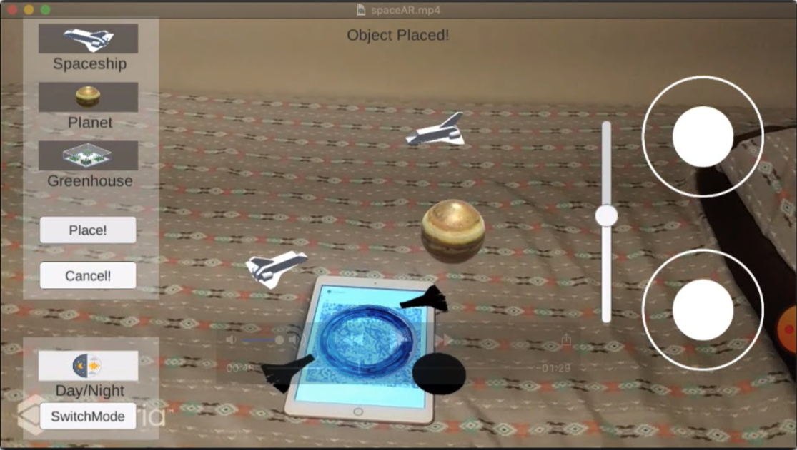
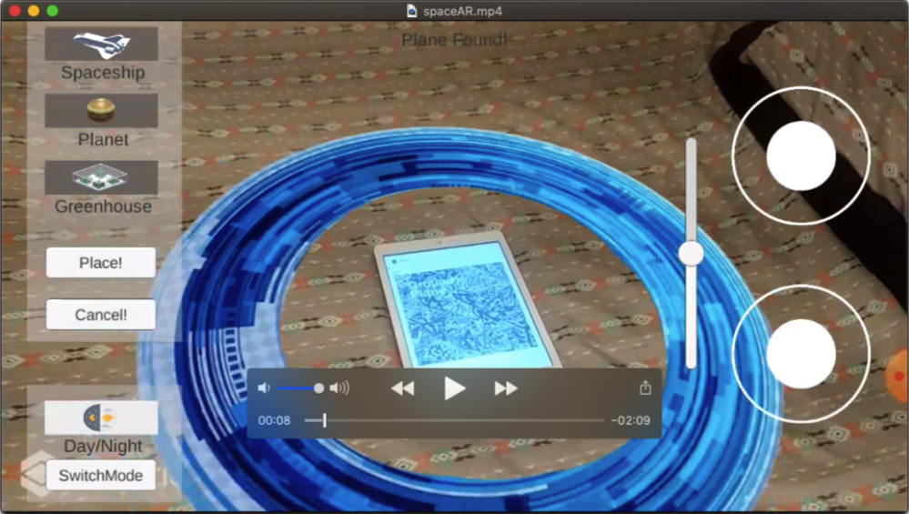
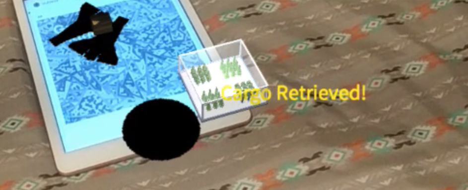
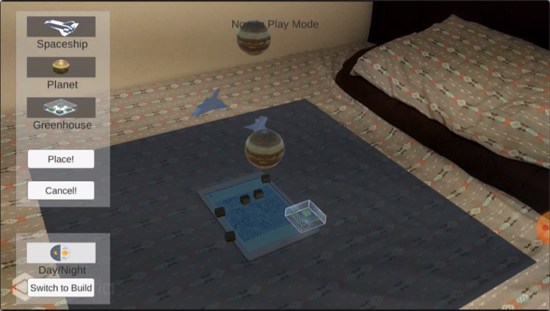

# Building Space Station in AR
A fun interactive game to build a cool space station on Mars in AR. Point the camera to a groundplane or a marker and start building!
You can place your greenhouses, spaceship and planets all around the space, and then hit "Play" to see them come alive traveling around your space. There are also some mini games and function for you to play with such as collecting dropped cargos to the greenhouses. 

Check out the demo right here!: https://www.youtube.com/watch?v=nddAm1J1M4E

  

## Gameplay Instructions
### Two modes of the game
- Build mode is for creating and placing objects. Play mode is for making objects alive and interacting with objects.
- User can switch between two modes any time by selecting the SwitchMode button at the bottom-left corner.
- When the app found the Image Target, a blue circle will pop up illustrating the plane we will be using to place objects.

  

### Build mode
- Create and placing object:
  - To create an object, select one of three icons (spaceship, planet, greenhouse) of the upper-left panel. A sample will appear in the middle of the ground plane. 
  - User then use the controllers at the right hand side to control: 
    - Spaceship: 
      - Control Position + Rotation + Height
    - Planet:
      - Control Position + Rotation + Height
    - Greenhouse:
      - Control Position + Rotation
- User then presses “Place!” to position the object in place (no more controls). Or presses “Cancel!” to omit that object.

### Play mode
- Animations:
  When switching to Play mode, users will see:
    - Spaceship moving back and forth, at the same time dropping cargo periodically. 
    - Planet turns around its own center and around the center of the detected plane.
- Interactions:
    - Users can drag the dropped cargos around the plane.
    - When the cargos are dragged to the greenhouse, they will be retrieved and notified with a popup yellow text.

  

- Day and Night:
    - User can switch between day and night by pressing the button “Day/Night” at the bottom-left panel.
    - When turning from day to night, the lights from the greenhouses will be turned on automatically. 

  

